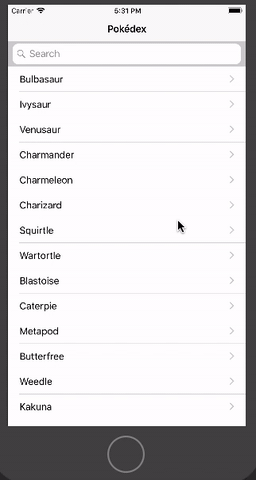

# CS50x Project
## Mobile (iOS): Pokedéx

## [Project Requirements](https://cs50.harvard.edu/x/2020/tracks/mobile/ios/pokedex/)
1. Search the Pokédex for Pokémon.
2. Catch and Release Pokémon.
3. Save last state.
4. View sprite of Pokémon.
5. Description of Pokémon.

---
